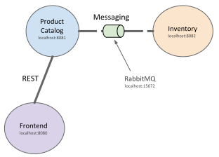

# Pact Contract Testing Examples

A sample micro-services application that demonstrates how Pact Contract tests work for REST as well as messaging interactions. Services implemented in Kotlin + Spring Boot.



## Running the demo application

In terminal 1 start RabbitMQ
```
$ docker-compose up
```

In terminal 2 start the inventory provider service
```
$ inventory/gradlew -p inventory bootRun
```

In terminal 3 start the catalog consumer/provider service
```
$ catalog/gradlew -p catalog bootRun
```

In terminal 4 start the frontend consumer service
```
$ frontend/gradlew -p frontend bootRun
```

Open in the browser http://localhost:8080/

## Running the demo Pact Broker

In a terminal start the dockerized pact broker.
```
$ docker-compose -f docker-compose-broker.yml up
```

Open the broker url http://localhost:8000/

## Consumer publishes pact to broker
```
./gradlew pactPublish
```

## Check with broker if service can be deployed
```
cd frontend
./gradlew canideploy -Ppacticipant='catalog' -Platest=true
```

## References
- https://docs.pact.io/implementation_guides/jvm/consumer/junit5
- https://docs.pact.io/implementation_guides/jvm/provider/junit5spring
- https://kreuzwerker.de/post/migrating-pact-contract-tests-from-junit4-to-junit5
- https://github.com/tinexw/cdc-with-pact/tree/junit5
- https://rieckpil.de/testing-your-spring-resttemplate-with-restclienttest

