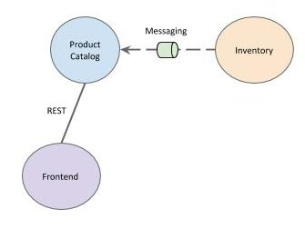

# Pact Workshop



## Running the demo application

In terminal 1 start the provider service
```
$ catalog/gradlew -p catalog bootRun
```

In terminal 2 start the consumer service
```
$ frontend/gradlew -p frontend bootRun
```

Open in the browser http://localhost:8080/

## References
- https://docs.pact.io/implementation_guides/jvm/consumer/junit5
- https://docs.pact.io/implementation_guides/jvm/provider/junit5spring
- https://kreuzwerker.de/post/migrating-pact-contract-tests-from-junit4-to-junit5
- https://github.com/tinexw/cdc-with-pact/tree/junit5

